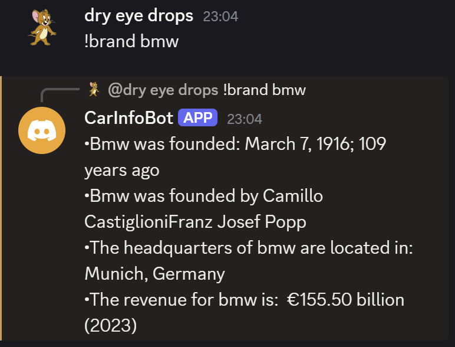
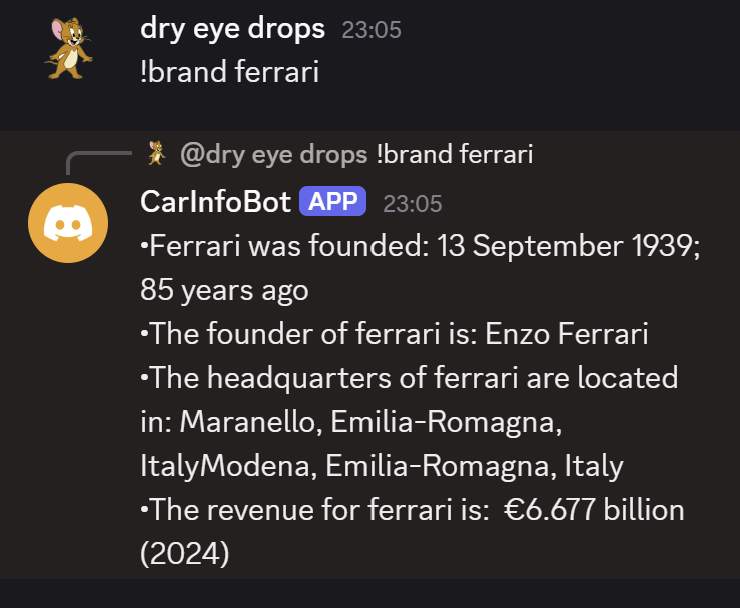
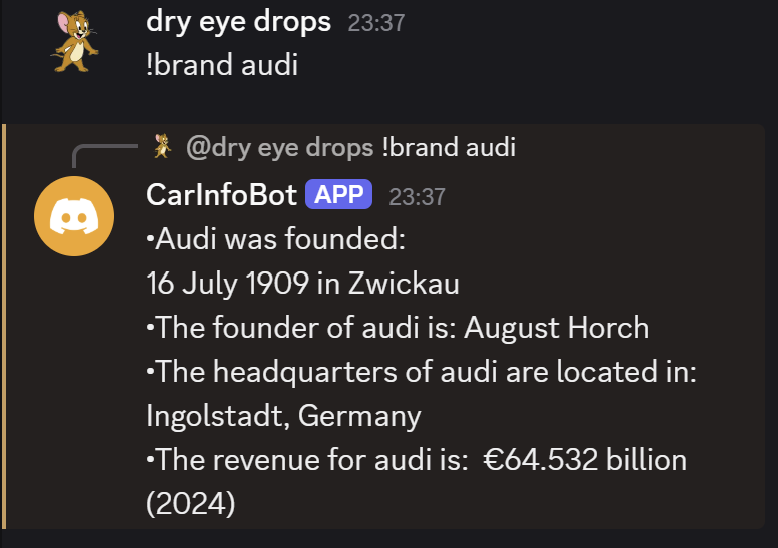
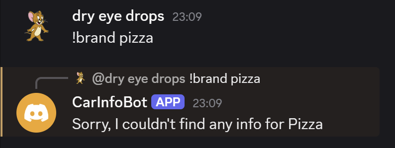

# Car Brand Discord Bot

A Discord bot which retrieves information about different car brands through web scraping from Wikipedia.

Testing:

Whilst testing, I found that the bot would return the correct information to the user every time.

 However, some information was missing depending on the car brand. For example, if revenue wasn't in the infobox (in the html) in the wikipedia page of a certain car brand, it would not be returned to the user, so some car brands have more information returned to the user than others.

 Examples:

 
 
 
 